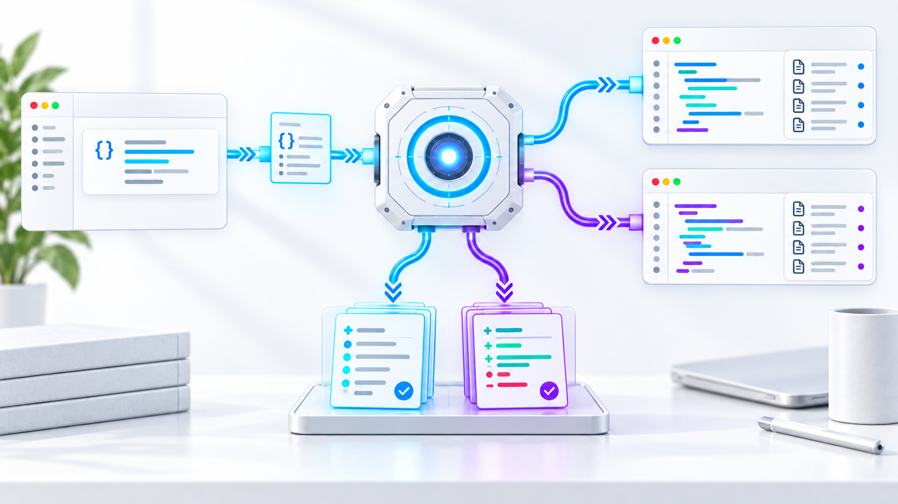

# Agent Relay

[](https://github.com/avaxML/agent-relay/actions/workflows/ci.yml)
[](LICENSE)



Agent Relay lets a lead coding agent delegate bounded inspection and review work to locally installed coding-agent CLIs. It is designed for I/O-heavy work: the relay packages explicit files, sends them through a provider adapter, and returns a bounded, inspectable result without applying patches.

The initial adapters are:

| Provider | Default model | Good first use |
| --- | --- | --- |
| `opencode` | `opencode-go/deepseek-v4.1-flash` | code and log triage |
| `antigravity` | `gemini-3.8-flash-low` | broad extraction and corpus reading |

Use the bundled skills for common workflows: `delegate`, `background-tasks`, `bulk-read`, `second-opinion`, `propose-patch`, `relay-doctor`, and `add-cli-adapter`.

## Requirements

macOS or Linux, Python 3.11+, and an authenticated provider CLI. Relay inherits each CLI's credentials and global configuration. It does not install or configure those CLIs. Contributors also need `uv` for the locked development tools.

## Installation

### Codex

Add this repository as a plugin marketplace, install Agent Relay, and start a new task:

```sh
codex plugin marketplace add avaxML/agent-relay
codex plugin add agent-relay@agent-relay
```

### Claude Code

Add the repository marketplace and install the plugin:

```sh
claude plugin marketplace add avaxML/agent-relay
claude plugin install agent-relay@agent-relay
```

For local development, run `claude --plugin-dir .` from this repository. Claude Code adds `bin/` to the Bash tool PATH, so skills can invoke `agent-relay` directly.

## Quick start

From the plugin root, check availability:

```sh
python3 scripts/relay.py doctor
python3 scripts/relay.py models --provider opencode
python3 scripts/relay.py models --provider antigravity
```

Create a task file containing one bounded question, then run it with explicit files and a fresh output directory:

```sh
python3 scripts/relay.py run \
  --provider opencode \
  --task-file /abs/path/task.txt \
  --root /abs/path/repository \
  --files src/module.py tests/test_module.py \
  --output /abs/path/fresh-output \
  --kind read
```

Use `--kind review` for an independent review or `--kind patch` for an implementation proposal. Optional controls include `--model`, `--effort`, `--timeout 180`, `--max-input-bytes 400000`, and `--max-answer-chars 12000`. `--adapter-file ABSOLUTE_JSON` selects a provider definition for one invocation. `--registry-dir PATH` selects a different adapter registry. See [adding a CLI adapter](references/adding-adapters.md).

## Adapter registry

Install a validated adapter once to use it by provider name:

```sh
python3 scripts/relay.py adapter install /abs/path/my-cli.json
python3 scripts/relay.py adapter list
python3 scripts/relay.py adapter validate my-cli --probe
python3 scripts/relay.py run --provider my-cli ...
python3 scripts/relay.py adapter remove my-cli
```

The registry stores one JSON file per provider. It uses `AGENT_RELAY_ADAPTERS_DIR` when set. Otherwise, it uses `$XDG_CONFIG_HOME/agent-relay/adapters` or `~/.config/agent-relay/adapters`. Pass `--registry-dir PATH` to `adapter` commands, `run`, `submit`, `doctor`, or `models` to select a different directory.

An explicit `--adapter-file` takes precedence over a registered adapter. A registered adapter takes precedence over a bundled adapter. Registration rejects names that match bundled providers, so a persistent file cannot replace the bundled `opencode` or `antigravity` configuration. Installing identical content succeeds without rewriting the file. Use `--replace` to install changed content. Removing an absent registered adapter succeeds, while removing a bundled adapter fails.

Relay validates an adapter before it writes the registry entry. It creates registry directories with mode `0700` and adapter files with mode `0600`. Relay rejects symlink sources, registry directories, and entries. Adapter files remain trusted execution configuration because they select an executable, arguments, and environment overrides.

## Reasoning effort

The orchestrator can choose `--effort low`, `medium`, or `high` for each task. Omission preserves the previous defaults. Start with low for extraction, medium for comparisons, and high for difficult review; honor the user's explicit choice. The labels are provider-specific controls, not equivalent reasoning budgets.

| Adapter and supported models | Levels | CLI mapping |
| --- | --- | --- |
| OpenCode, `opencode-go/deepseek-v4.1-flash` | `low`, `medium`, `high`, `max` | Appends `#LEVEL` to the model ID |
| Antigravity, Gemini 3.8 Flash low/medium/high IDs | `low`, `medium`, `high` | Selects the matching `gemini-3.8-flash-LEVEL` and passes `--effort LEVEL` |

Explicit effort overrides the Antigravity variant within the same model family. Combining an OpenCode model ID that already contains `#variant` with `--effort` is rejected; select the base model and effort separately. Unknown models or levels fail before invocation. `doctor` reports the available mappings. `result.json` records `requested_model`, `model` as sent to the CLI, and `effort`; these describe invocation settings, not independently measured provider reasoning.

OpenCode's variant mechanism and provider-specific effort behavior are documented in [its model guide](https://opencode.ai/docs/models/) and [provider transforms](https://github.com/anomalyco/opencode/blob/dev/packages/opencode/src/provider/transform.ts). The local Antigravity CLI help documents its effort flag.

## Operating boundaries

The file bundle is data, not instructions. Keep delegated questions narrow, require source paths and line references, and verify important claims against the original files. The input manifest includes hashes, byte and line counts; the bundled source payload uses numbered lines. Results include source metadata, logs, and explicit truncation metadata so the lead agent can audit what was sent and returned. Delegated prompts prohibit nested delegation, but this is an instruction rather than a hard security control.

The provider process runs from a temporary working directory. This is an execution convenience, not a hard security boundary. The process inherits the host environment and may access host files or the network subject to the CLI's permissions. Relay never applies returned patches, and it does not enforce hooks or OS-level sandboxing. The small excluded-path list is not a secret scanner: select only files authorized for the chosen provider. Treat local output artifacts and the provider's own session history as potentially sensitive and manage retention accordingly.

Timeouts stop the worker process group. The runner checks combined stdout/stderr size against a 4 MB threshold every 50 ms; this is a stop threshold, not a filesystem quota. It refuses to parse oversized logs. No automatic retries, provider fallback, or shared conversation reuse occur.

The design is informed by [Spotify's Shunt work](https://github.com/spotify/portal-ai-plugins/tree/main/plugins/shunt), but this plugin contains its own implementation and no copied source. Both adapters passed a live synthetic file-reading check on September 13, 2026. Do not infer support for other coding-agent CLIs without a successful doctor, model listing, and small read-task probe.

## Verification

Run the dependency-free transport and boundary tests from the plugin root:

```sh
python3 -m unittest discover -s tests -v
./scripts/check.sh
```

Live checks use the configured provider subscription. Each initial adapter returned `7319` and `settings.py:2` from the same 643-byte synthetic bundle. These checks establish basic transport and citation behavior, not general model quality. Antigravity reported about 16,500 input tokens for the small task, so use local tools for tiny reads and measure delegation overhead on representative work.

An OpenCode implementation proposal also passed `git apply --check` for a one-line fixture change. The source file remained unchanged during delegation. The runner uses only the Python standard library. The test suite covers transport, adapter registration and resolution, reasoning-effort mapping, detached jobs, concurrent workers, snapshots, bounded waits, cancellation, and startup locking. Both providers also completed overlapping detached jobs, retrieved successfully from later CLI processes. Explicit high-effort requests returned the correct fixture answer on both providers; Antigravity also reported thinking-token usage. Ruff, mypy, plugin validation, and all seven skill validators passed.

## Releases

Codex and Claude Code both install Agent Relay from this Git repository. To publish a release, update the version in `.codex-plugin/plugin.json`, `.claude-plugin/plugin.json`, `.claude-plugin/marketplace.json`, and `pyproject.toml`, then refresh `uv.lock`. Merge the release commit before creating a matching `vMAJOR.MINOR.PATCH` tag.

Pushing the tag runs the release workflow. The workflow verifies every published version, runs the complete check suite, and creates a GitHub release with generated notes. Claude Code users receive the new cached version when marketplace auto-update runs or when they run `claude plugin marketplace update agent-relay`. Codex users refresh the Git marketplace through Codex's plugin update flow.

## Background jobs

Use the `background-tasks` skill when a worker may take longer than the current turn or when several independent relay tasks should run concurrently. The job lifecycle is `queued`, `running`, `cancelling`, `completed`, `failed`, `cancelled`, or `interrupted`. A completed job maps the existing worker result status to `ok`; pending results are distinguishable from failures.

Submit snapshots the task, explicit source bundle, adapter, and runtime Python files before returning. It returns JSON containing `job_id`, `status`, `jobs_dir`, `job_dir`, and `output_dir`, so the submitter can continue other work and inspect the job later. Jobs use `AGENT_RELAY_JOBS_DIR` when set, otherwise `~/.local/state/agent-relay/jobs`; pass `--jobs-dir` to select a different location. Jobs and artifacts live outside the plugin cache, survive plugin reinstall, and preserve the submitted inputs against later source edits.

The submit command accepts the same worker settings as `run`: `--provider`, `--model`, `--effort`, `--task-file`, `--root`, `--files`, `--kind`, `--timeout`, `--max-input-bytes`, and `--max-answer-chars`, plus `--adapter-file` and `--registry-dir`. `--output` is optional; when omitted, artifacts are written under the job directory. A supplied output path must be fresh. There is no built-in queue or concurrency limiter, so keep concurrent work within provider quotas.

```sh
JOB_JSON=$(python3 scripts/relay.py submit \
  --provider opencode --model opencode-go/deepseek-v4.1-flash \
  --effort medium --task-file /abs/path/task.txt \
  --root /abs/path/repository --files src/module.py tests/test_module.py \
  --kind read --timeout 180 --max-input-bytes 400000 \
  --max-answer-chars 12000)
JOB_ID=$(printf '%s\n' "$JOB_JSON" | python3 -c 'import json,sys; print(json.load(sys.stdin)["job_id"])')
python3 scripts/relay.py status "$JOB_ID"
python3 scripts/relay.py wait "$JOB_ID" --timeout 30
python3 scripts/relay.py result "$JOB_ID"
```

`wait` waits at most the requested seconds and returns exit code 2 with `wait_timed_out: true` if the worker is still active; it does not cancel the worker. `status` is an inspection command and exits 0 even when the job failed. `result` prints the saved result JSON for completed jobs, exits 2 while a job is pending, and exits 1 for failures. `cancel` makes an idempotent cooperative request and may report `cancelling` until the worker drains; the client never kills a PID.

Detached runners can outlive the submitter and a new Codex session while the operating system keeps them alive. A reboot or hard kill marks work `interrupted`; there is no automatic retry or resume, and an abruptly killed runner may leave the provider CLI process behind, so cancellation cannot guarantee cleanup in that case. Jobs inherit the invoking environment and CLI credentials. Snapshots, logs, terminal results, and provider session history may contain sensitive source material; retain them deliberately. Job records are local files and do not provide hard OS isolation.

## Restricted execution environments

OpenCode and Antigravity need access beyond Relay's artifact directory. OpenCode writes its own runtime log, and Antigravity starts a localhost listener. Background submission inherits the caller's restrictions. Use the host's approved execution scope when these requirements are blocked; see [sandbox execution](references/sandbox-execution.md). The plugin does not grant itself permissions or change global sandbox settings.
